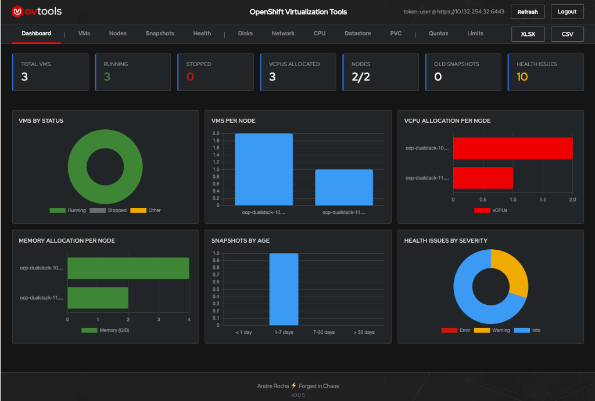
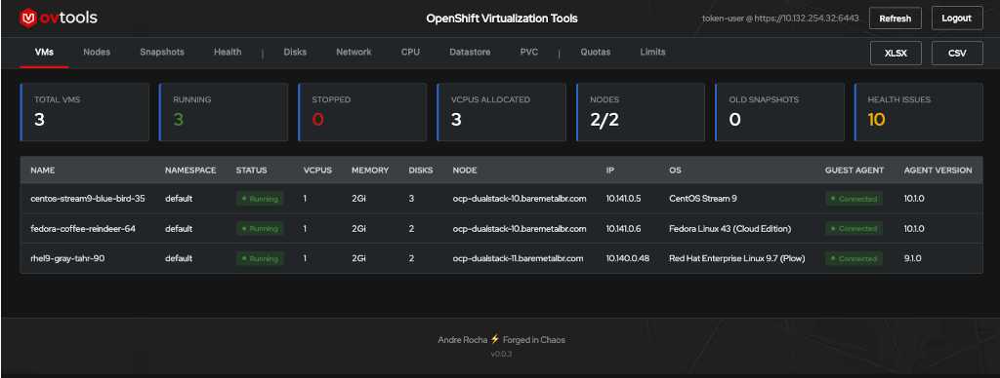
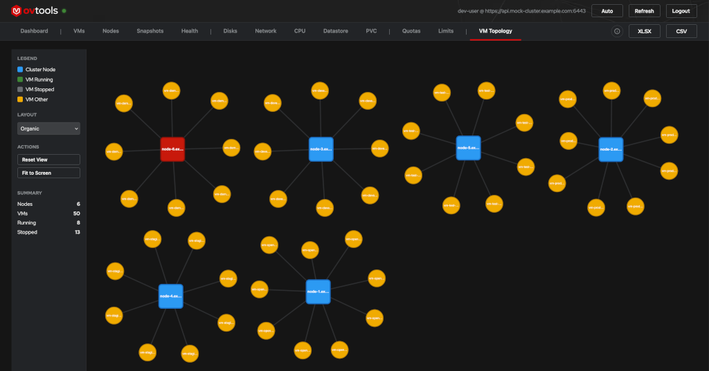
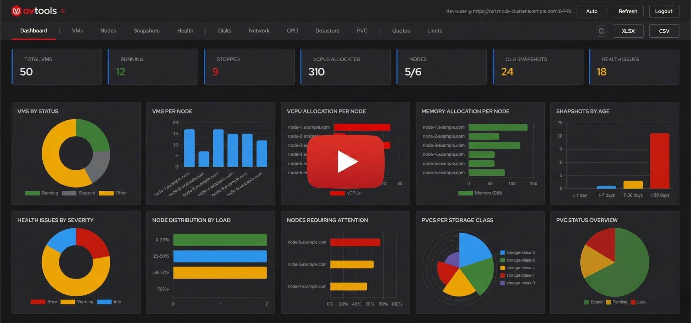
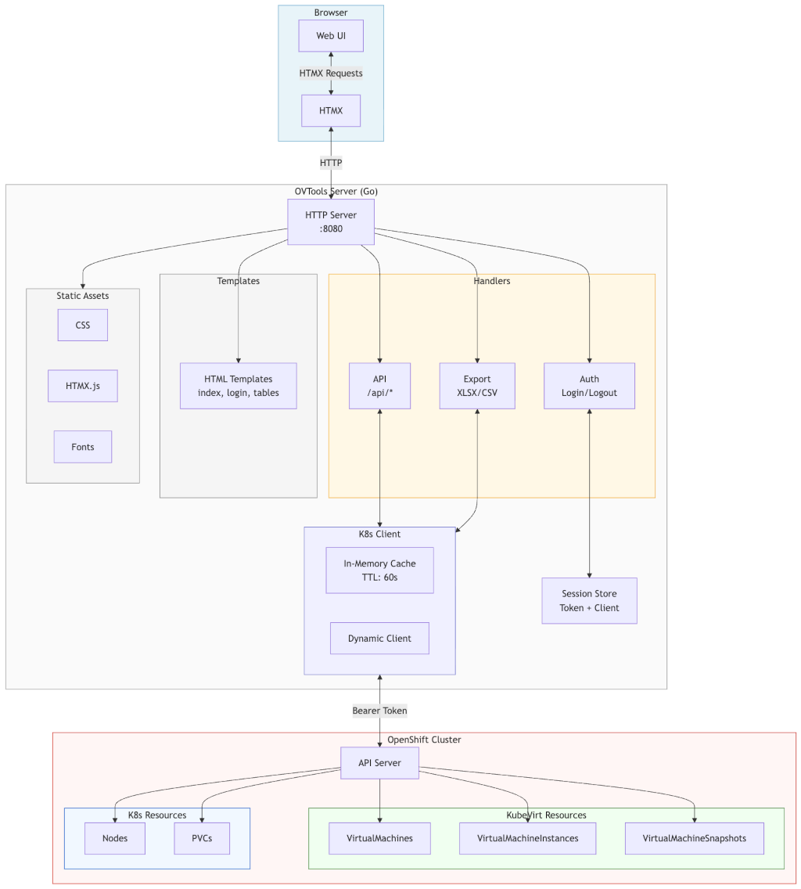

# OVTools

**OVTools (OpenShift Virtualization Tools)** is a web-based inventory and operational visibility tool for **OpenShift Virtualization**, inspired by the familiar experience of **RVTools** in VMware environments.

It was created to help teams migrating from VMware regain fast, centralized visibility into their virtual machines, nodes, and operational health, without bypassing OpenShift-native concepts such as **RBAC**, **namespaces**, and **multi-tenancy**.







## Why OVTools?

During VMware to OpenShift Virtualization migrations, teams often lose the tooling they relied on for day-to-day operations. While the data still exists in Kubernetes APIs, consuming it usually requires CLI commands, YAML parsing, or custom scripts.

OVTools bridges this gap by translating Kubernetes and KubeVirt resources into a **clear**, **human-friendly operational view**, enabling faster troubleshooting, capacity planning, and reporting.

## Features

- **VM Inventory**  
  Centralized view of all virtual machines with status, resources, IPs, and guest agent information.
  
- **Node Overview**  
  Cluster nodes with capacity details, workload distribution, and overcommit ratios.

- **Snapshot Visibility**  
  Track VM snapshots with age-based warnings to maintain snapshot hygiene.

- **Health Checks**
  Detect common configuration issues, missing resource limits, disconnected guest agents, and node problems.

- **Export Capabilities**
  Download inventory and operational data as Excel (XLSX) or CSV files, compatible with existing reporting workflows.

- **Auto-refresh**
  Live data with automatic refresh every 30 seconds without losing context.

- **Multi-user Access**
  Session-based authentication using each user’s own OpenShift credentials.

## Authentication and Security

OVTools uses **delegated authentication**, meaning:

- Users authenticate with their own OpenShift credentials
- All access respects existing RBAC rules
- No privileged service accounts are required
- Credentials are never stored or persisted
- Sessions automatically expire after 1 hour

### Supported Authentication Methods

| Method | Description | Typical Use |
|--------|-------------|-------------|
| **Token** | `oc whoami -t` | Quick access |
| **Kubeconfig** | Paste kubeconfig content | Full context-based access |


## Quick Start

### Run locally (container)

```sh
podman run -d --name ovtools-app -p 8080:8080  quay.io/andrerocha_redhat/ovtools:latest
```

Access:

```sh
open http://<IP>:8080
```

## Dev Mode (Demo Mode)

Dev Mode allows you to explore OVTools **without connecting to a real cluster**.
The UI is fully functional and populated with sample data, making it ideal for:

- Demos
- Evaluations
- Screenshots
- Feature exploration

```sh
podman run --env OVTOOLS_DEV_MODE=true --replace -d --name ovtools-app -p 8080:8080  quay.io/andrerocha_redhat/ovtools:latest
```

## Deploying on OpenShift

```bash
oc new-project ovtools
oc apply -f deploy/openshift/
```

Get route URL:

```sh
oc get route ovtools -o jsonpath='{.spec.host}'
```

## Configuration Flags

| Flag | Default | Description |
|------|---------|-------------|
| `-bind` | `0.0.0.0` | Listen address |
| `-port` | `8080` | HTTP port |
| `-cache-ttl` | `60` | Cache TTL (seconds) |
| `-version` | - | Show version and exit |


## See OVTools in action!

[](https://github.com/linuxelitebr/ovtools-release/releases/download/v0.1.5/ovtools.mp4)


## Architecture



## License

Apache Apache License 2.0

## Author

Andre Rocha ⚡️ Forged in Chaos