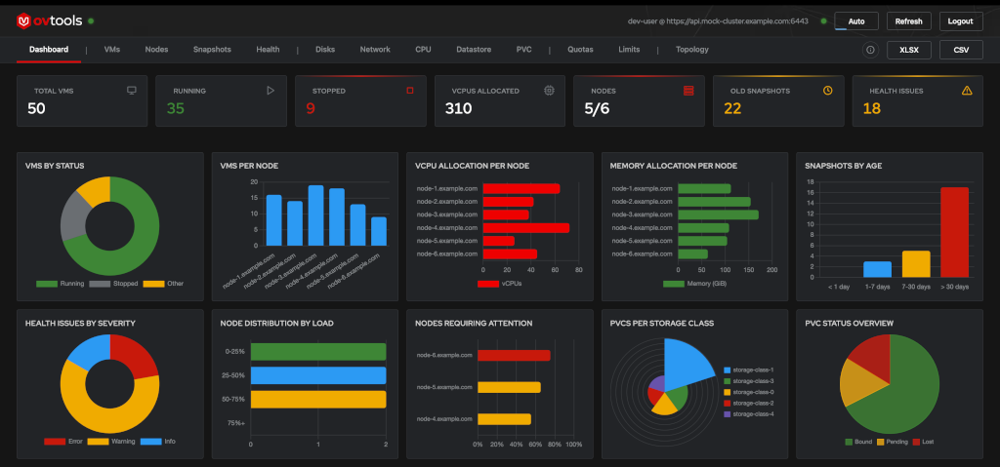
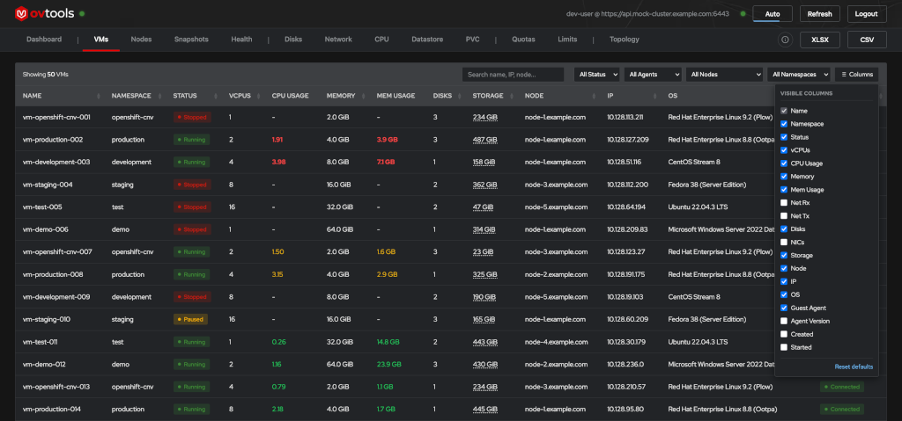
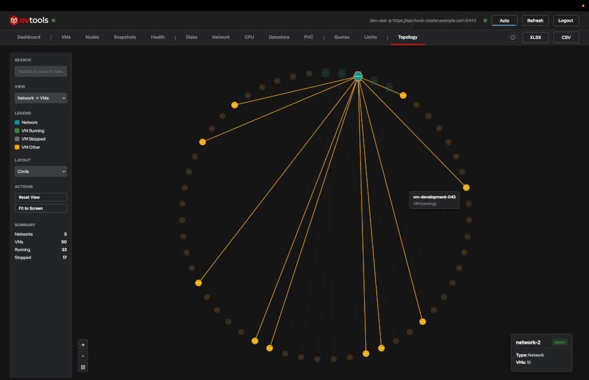
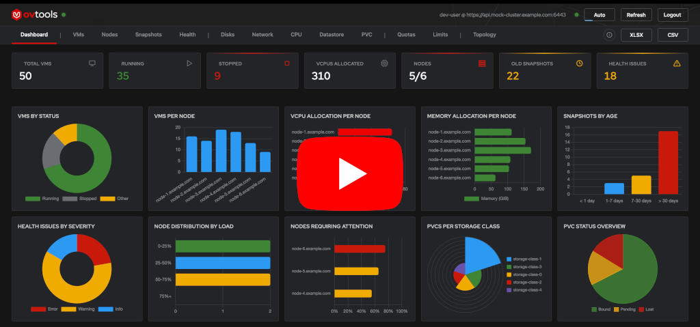
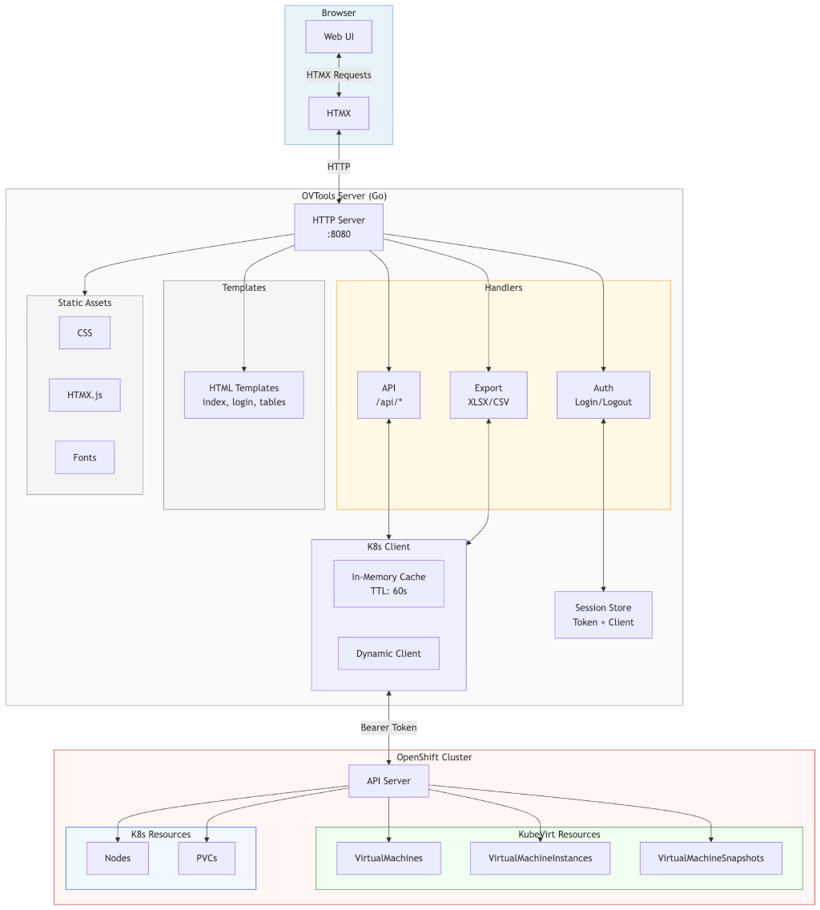

# OVTools

[](https://github.com/elastocera/ovtools/actions/workflows/ci.yml)
[](https://github.com/elastocera/ovtools/releases)
[](LICENSE)
[](go.mod)
[](https://github.com/elastocera/ovtools/pkgs/container/ovtools)

**OVTools (OpenShift Virtualization Tools)** is a web-based inventory and operational visibility tool for **OpenShift Virtualization**, inspired by the familiar experience of **RVTools** in VMware environments.

It was created to help teams migrating from VMware regain fast, centralized visibility into their virtual machines, nodes, and operational health, without bypassing OpenShift-native concepts such as **RBAC**, **namespaces**, and **multi-tenancy**.







## Why OVTools?

During VMware to OpenShift Virtualization migrations, teams lose the tooling they relied on day to day. The data still lives in the Kubernetes API. Getting at it usually means CLI commands, YAML parsing, or one-off scripts.

OVTools translates Kubernetes and KubeVirt resources into a plain operational view, so troubleshooting, capacity planning, and reporting work the way they did before the migration.

## Features

- **VM inventory**
  All virtual machines in one table with status, resources, IPs, and guest agent info.

- **Node overview**
  Cluster nodes with capacity, workload distribution, and overcommit ratios.

- **Snapshot visibility**
  VM snapshots with age-based warnings, so old ones do not pile up unnoticed.

- **Health checks**
  Surfaces the usual suspects: missing resource limits, disconnected guest agents, node problems.

- **Exports**
  Download inventory and operational data as XLSX or CSV. Plays well with existing reporting workflows.

- **Auto-refresh**
  Live data refreshed every 60 seconds without dropping the user's place in the UI.

- **Multi-user access**
  Session-based authentication. Every user logs in with their own OpenShift credentials.

- **In-cluster SSO**
  Deployed on OpenShift with the bundled `deployment.yaml`, users already logged into the console land in OVTools through oauth-proxy. No token required. Works on standalone OpenShift and Hypershift.

## Authentication and Security

OVTools uses delegated authentication. What that means in practice:

- Users authenticate with their own OpenShift credentials.
- Access respects existing RBAC rules.
- No privileged service accounts.
- Credentials are never stored or persisted.
- Sessions expire after 1 hour.

### Supported Authentication Methods

| Method | Description | Typical Use |
|--------|-------------|-------------|
| **Token** | `oc whoami -t` | Quick access, local/external use |
| **Kubeconfig** | Paste kubeconfig content | Full context-based access |
| **SSO (oauth-proxy)** | Automatic via OpenShift console session | In-cluster deployment |

When deployed in-cluster with `deploy/openshift/deployment.yaml`, authentication is handled by `ose-oauth-proxy`. Users already logged into the OpenShift console access OVTools without any extra step. Per-user RBAC is enforced through Kubernetes user impersonation.


## Quick Start

### Run locally (container)

Start the container and bind it to port 8080:

```sh
podman run -d --name ovtools-app -p 8080:8080  ghcr.io/elastocera/ovtools:latest
```

Open the UI:

```sh
open http://<IP>:8080
```

## Dev Mode (Demo Mode)

Dev Mode runs the UI without a real cluster, populated with sample data. Good for demos, evaluations, screenshots, and walking through features:

```sh
podman run --env OVTOOLS_DEV_MODE=true --replace -d --name ovtools-app -p 8080:8080  ghcr.io/elastocera/ovtools:latest
```

## Deploying on OpenShift

Apply the manifests:

```bash
oc new-project ovtools
oc apply -f deploy/openshift/
```

Get the route URL:

```sh
oc get route ovtools -o jsonpath='{.spec.host}'
```

## Configuration Flags

| Flag | Default | Description |
|------|---------|-------------|
| `-bind` | `0.0.0.0` | Listen address |
| `-port` | `8080` | HTTP port |
| `-cache-ttl` | `60` | Cache TTL (seconds) |
| `-api-timeout` | `60` | API request timeout (seconds) |
| `-prometheus-url` | (auto) | Override auto-discovered Prometheus/Thanos URL |
| `-version` | - | Show version and exit |

## Supported ENVs

| Variable | Description | Default | Example |
|----------|-------------|---------|---------|
| `OVTOOLS_DEV_MODE` | Enable developer mode with mock data (no cluster required) | `false` | `true` |
| `OVTOOLS_API_TIMEOUT` | Kubernetes API request timeout in seconds | `60` | `120` |
| `OVTOOLS_PROMETHEUS_URL` | Override auto-discovered Prometheus/Thanos URL | (auto) | `https://localhost:9091` |
| `KUBECONFIG` | Path to kubeconfig file | `~/.kube/config` | `/path/to/kubeconfig` |

## See OVTools in action!

[](https://youtu.be/kbkQfYaSLZA)

## Architecture



## Requirements

OVTools runs in two modes. Each has slightly different connectivity needs.

### Running in-cluster (recommended for shared access)

When deployed as a Pod via the bundled YAML, OVTools auto-discovers the OpenShift API server and Prometheus through internal cluster DNS. No additional setup is required beyond applying the deployment manifest.

### Running locally (single-user workstation)

When running the binary on your laptop or workstation, your machine must be able to reach both:

1. The OpenShift API server. The same hostname you use with oc login (e.g. `https://api.<cluster>.<domain>:6443`).

2. The cluster's Prometheus / Thanos route. Typically `thanos-querier-openshift-monitoring.apps.<cluster>.<domain>`. You can confirm the exact hostname with:

```bash
oc get route -n openshift-monitoring thanos-querier -o jsonpath='https://{.spec.host}'
```

If your machine cannot resolve the `*.apps.<cluster>.<domain>` wildcard (common on remote / corporate networks), options are:

- Connect through the VPN that grants access to the cluster.
- Add an `/etc/hosts` entry for the Prometheus hostname pointing to a router IP.
- Use `oc port-forward -n openshift-monitoring svc/thanos-querier 9091:9091` and start OVTools with `-prometheus-url https://localhost:9091` (or set `OVTOOLS_PROMETHEUS_URL`).

OVTools works without Prometheus access, but tabs that depend on real-time metrics (CPU, memory, network and storage usage) will show "-" instead of values.

## Troubleshooting

### Upgrading from an older version: `spec.selector field is immutable`

When upgrading from an older OVTools release, `oc apply -f deployment.yaml` may fail with:

```
The Deployment "ovtools" is invalid: spec.selector: ... field is immutable
```

This happens because some older releases used a different label selector, and Kubernetes does not allow changing `spec.selector` on an existing Deployment. Recreate just the Deployment. Everything else (Namespace, ServiceAccount, RBAC, Secrets, Route) is preserved:

```bash
oc delete deployment ovtools -n ovtools
oc apply -f deployment.yaml
```

The bundled `install.sh` detects this case automatically and offers to recreate the Deployment for you.

## License

Apache Apache License 2.0

## Author

Andre Rocha ⚡️ Forged in Chaos
